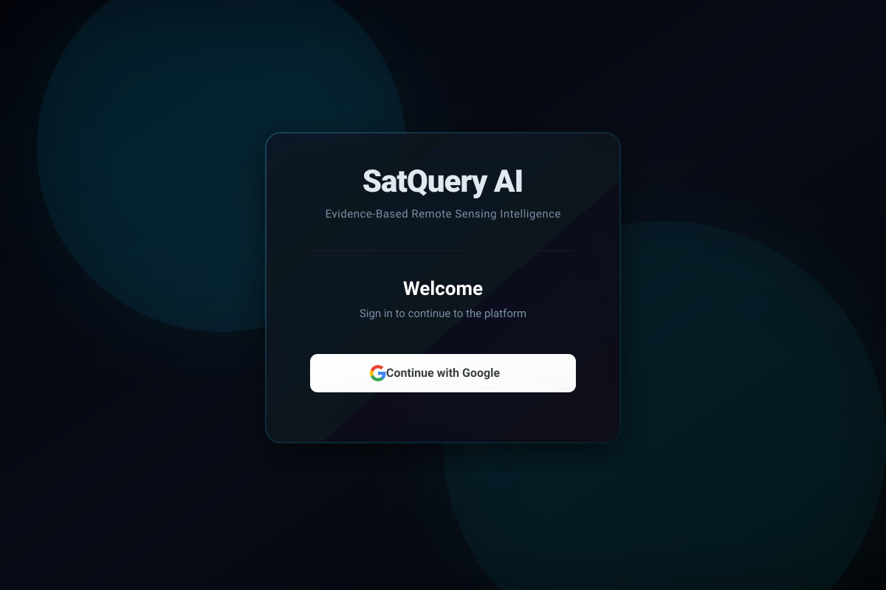

<div align="center">
  <a href="https://satquery-ai-v3.vercel.app">
    
  </a>
  <br />
  
  <p>
    <a href="https://satquery-ai-v3.vercel.app"></a>
    <a href="https://krshz-sudo-sih-3-0-guiapp-0esz5j.streamlit.app/"></a>
  </p>

  <p><em>Developed for SIH 2026 | ISRO Problem Statement 26167</em></p>
</div>

---

## 📌 The Problem: ISRO PS-26167
In the realm of Earth Observation, rapidly interpreting complex Synthetic Aperture Radar (SAR) and multi-spectral optical data is highly challenging. SAR imagery, in particular, suffers from speckle noise, geometric distortions (layover, foreshortening), and non-intuitive backscatter patterns that traditional computer vision models struggle to generalize. 

**SatQuery AI solves this by introducing a pure Vision-Language Model (VLM) approach.** Instead of relying on rigid, pre-trained CNNs for narrow tasks, we leverage **Google Gemini 3.6 Flash** to perform zero-shot visual reasoning, semantic land-cover classification, change detection, and dynamic feature extraction through natural language prompting.

## 🚀 What is SatQuery AI?
SatQuery AI transforms complex satellite and SAR imagery into structured, evidence-grounded insights. By harnessing advanced multimodal prompting, the platform delivers high-precision analytics with zero hallucinated locations. 

The system enforces strict **Evidence-Based Interpretation Guardrails**, clearly distinguishing between what is directly observed (e.g., *high backscatter corner reflectors*) and what is inferred (e.g., *dense urban settlement*), completely eliminating the generation of unverified geospatial metadata.

---

## 🛠️ Comprehensive Tech Stack

| Domain | Technology | Role |
|:---|:---|:---|
| **AI / ML Engine** | Google Gemini 3.6 Flash | Sole multimodal inference engine for visual QA, bounding box generation, and JSON structuring. |
| **Auth & Landing** | React, Vite, CSS3 | High-performance, cinematic frontend hosted on **Vercel**. |
| **Authentication** | Supabase OAuth | Secure Google SSO integration, protecting the main dashboard. |
| **Data Dashboard** | Streamlit, Python 3.10 | The interactive analytical interface hosted on **Streamlit Community Cloud**. |
| **Geospatial Processing** | GDAL, GeoTIFF, OpenCV | Raster loading, geospatial metadata extraction, and masking. |
| **Data Viz & UI** | Plotly, Pillow | Dynamic generation of confidence distribution charts and annotated images. |

---

## 🏗️ Deep-Tech Architecture & Data Pipeline

SatQuery AI operates on a high-efficiency, dual-node architecture designed to handle both rapid user authentication and heavy-duty image inference.

<div align="center">
  
</div>

### 1. Secure Ingress (Vercel Node)
- **Cinematic Entry**: Users are greeted by a fully responsive, visually striking landing page built with Vite.
- **Identity Management**: Authentication is fully offloaded to **Supabase**. Once verified via Google OAuth, the session token is validated, and the user is securely redirected to the analytical node.

### 2. Analytical Engine (Streamlit Node)
- **Multimodal Ingestion**: Supports `.tif`, `.png`, and `.jpg`. Automatically reads embedded GeoTIFF metadata where available.
- **Prompt Engineering Pipeline**: Depending on the selected mode (Single Image, Bi-Temporal, SAR+Optical Fusion), the system compiles a rigid, schema-bound prompt designed for Gemini.
- **Inference & Grounding**: Gemini returns a strictly validated JSON object containing normalized bounding box coordinates (`0-1000`). Our custom `annotation_renderer` scales these coordinates to the native image resolution and plots category-coded bounding boxes.
- **Data Rendering**: The structured JSON is parsed in real-time to generate interactive Plotly charts, confidence metrics, CSV reports, and side-by-side verification maps.

---

## 🌟 Functional Features

- **Pure Gemini Integration**: No Ollama, CNNs, or secondary AI fallbacks required.
- **Visual Grounding**: Automatic Bounding Boxes overlayed directly on your imagery.
- **Multi-Modal Support**: Single Image Analysis, Bi-Temporal Change Detection, and Optical + SAR Fusion.
- **Mobile Optimized**: The platform scales seamlessly across desktop and mobile devices.
- **One-Click Exports**: Download high-resolution annotated satellite maps (PNG) and structured evidence reports (CSV).

---

## ⚡ Quick Start & Local Setup

### Option 1: Running the AI Engine (Streamlit)
```bash
git clone https://github.com/krshz-sudo/sih_3.0.git
cd sih_3.0

python -m venv venv
source venv/bin/activate  # On Windows: venv\Scripts\activate

pip install -r requirements.txt

# Create .env file
echo "GEMINI_API_KEY=your_gemini_api_key_here" > .env
echo "GEMINI_MODEL=gemini-3.6-flash" >> .env

streamlit run gui/app.py
```

### Option 2: Running the Auth Portal (Vite)
```bash
cd web
npm install
npm run dev
```

---
<div align="center">
  <sub>Developed by the <b>SatQuery AI Team</b> for SIH 2026. Built with ❤️ and 🛰️</sub>
</div>
